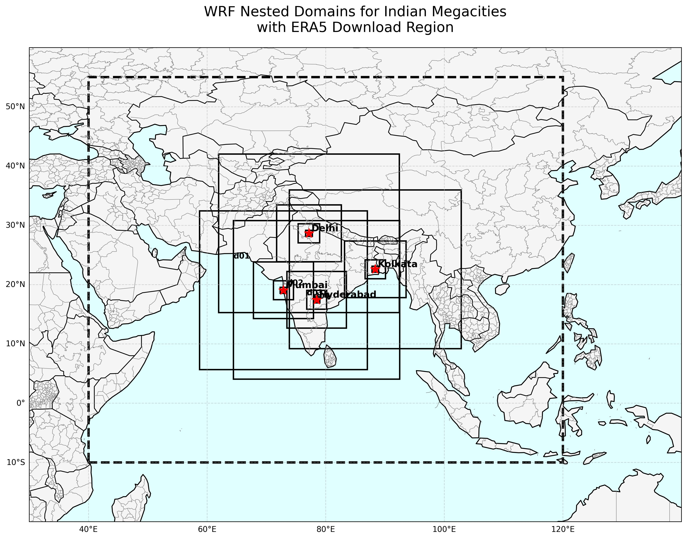

# ERA5 Reanalysis

ERA5 is the fifth-generation global atmospheric reanalysis product developed by the European Centre for Medium-Range Weather Forecasts (ECMWF). It provides a physically consistent representation of atmospheric, land-surface, and oceanic conditions by combining observations with numerical weather prediction models.

ERA5 is one of the most widely used datasets for generating Initial Conditions (IC) and Boundary Conditions (BC) for Weather Research and Forecasting (WRF) simulations due to its global coverage, hourly temporal resolution, and long-term availability.

This directory contains practical scripts used to download ERA5 datasets for WRF preprocessing and simulation workflows.

---

## Contents

This section covers:

- ERA5 data acquisition using CDS API
- ERA5 single-level and pressure-level data download
- Same-month and consecutive-month data download scripts
- HPC-based automated downloading using Slurm
- ERA5 domain selection for Indian urban simulations
- Preparation of ERA5 datasets for WRF and WPS workflows

---

## About CDS API

The Climate Data Store Application Programming Interface (CDS API) is the official method for accessing ERA5 datasets programmatically from ECMWF's Climate Data Store.

Using CDS API allows users to:

- Automate and download large datasets efficiently
- Create reproducible workflows
- Execute downloads directly on Linux servers and HPC systems
- Avoid manual web-interface downloads

### Installation

```
pip install cdsapi
```

### Configuration

Create a CDS account and obtain an API key from the Climate Data Store.

Create:

```
~/.cdsapirc
```

Example:

```
url: https://cds.climate.copernicus.eu/api
key: <UID>:<API_KEY>
```

Once configured, ERA5 datasets can be downloaded directly through Python scripts.

---

## Files Included

```
ERA5/
├── era5_surface_same_months.py
├── era5_pressure_same_months.py
├── era5_surface_consecutive_months.py
├── era5_pressure_consecutive_months.py
├── submit_era5.sh
├── wrf_era5_domain_map.py
└── WRF_All_Cities_ERA5_Domain_Map.jpg
```

---

## ERA5 Download Domain

The example scripts use the following geographical subset:

```
"area": [55, 40, -10, 120]
```

where:

```
North = 55°N
West  = 40°E
South = 10°S
East  = 120°E
```


This domain encompasses Indian subcontinent and adjacent oceanic regions required for regional atmospheric simulations. Note that the selected region is sufficiently large to support multiple WRF domains centered over major Indian cities while maintaining adequate boundary coverage.

---

## ERA5 Domain Visualization

The repository includes a visualization showing:

- ERA5 download region
- WRF nested domains
- Example domain configurations
- Major Indian megacities

Image:

```
WRF_All_Cities_ERA5_Domain_Map.jpg
```

The corresponding script used to generate the figure is:

```
wrf_era5_domain_map.py
```

The example demonstrates nested WRF domains centered over Delhi, Mumbai, Hyderabad, Kolkata and can be used as a reference when selecting ERA5 download boundaries for urban and regional climate studies. The ERA5 boundary is intentionally larger than the WRF outermost domain to ensure sufficient meteorological information is available during preprocessing and model integration.

---

## ERA5 Single-Level Data

File:

```text
era5_surface_same_months.py
```

This script downloads surface and near-surface variables required by WRF.

### Variables Downloaded

#### Near-Surface Meteorology

- 2 m Temperature
- 2 m Dewpoint Temperature
- 10 m U Wind Component
- 10 m V Wind Component

#### Pressure Fields

- Surface Pressure
- Mean Sea Level Pressure

#### Surface Temperature Fields

- Skin Temperature
- Sea Surface Temperature

#### Cryosphere Fields

- Snow Depth
- Sea Ice Cover

#### Soil Variables

- Soil Temperature Level 1
- Soil Temperature Level 2
- Soil Temperature Level 3
- Soil Temperature Level 4
- Volumetric Soil Water Layer 1
- Volumetric Soil Water Layer 2
- Volumetric Soil Water Layer 3
- Volumetric Soil Water Layer 4

#### Static Fields

- Land-Sea Mask

---

## ERA5 Pressure-Level Data

File:

```
era5_pressure_same_months.py
```

This script downloads three-dimensional atmospheric fields required for WRF initialization and boundary condition generation.

### Variables Downloaded

- Geopotential
- Temperature
- Relative Humidity
- Specific Humidity
- U Component of Wind
- V Component of Wind

### Pressure Levels

The following ERA5 pressure levels are retrieved:

```
1000, 975, 950, 925, 900, 875, 850, 825, 800, 775,
750, 700, 650, 600, 550, 500, 450, 400, 350, 300,
250, 225, 200, 175, 150, 125, 100, 70, 50, 30,
20, 10, 7, 5, 3, 2, 1 hPa
```

These levels provide the three-dimensional atmospheric structure required by WRF.

---

## Same-Month Simulations

The following scripts are designed for simulation periods occurring entirely within a single calendar month.

### Surface Data

```
era5_surface_same_months.py
```

### Pressure-Level Data

```
era5_pressure_same_months.py
```

Example:

```
17 May 2023 – 21 May 2023
```

---

## Consecutive-Month Simulations

Some WRF simulations span across multiple calendar months.

Examples include:

```
28 Apr – 02 May
29 Jun – 03 Jul
30 Dec – 03 Jan
```

Separate scripts are provided for these situations.

### Surface Data

```
era5_surface_consecutive_months.py
```

### Pressure-Level Data

```
era5_pressure_consecutive_months.py
```

These scripts use multiple month entries within a single CDS API request, allowing seamless retrieval of ERA5 data across month boundaries.

---

## Temporal Resolution

All scripts retrieve:

- Hourly ERA5 data
- 24 time steps per day

```
00:00, 01:00, 02:00, ..., 22:00, 23:00
```

Hourly forcing is commonly used for generating WRF initial and boundary conditions.

---

## Running Downloads on HPC

A sample Slurm submission script is provided:

```
submit_era5.sh
```

### Resource Configuration

```bash
#SBATCH --partition=speed
#SBATCH --nodes=1
#SBATCH --ntasks=1
#SBATCH --cpus-per-task=1
#SBATCH --time=24:00:00
```

### Load Python Environment

```
module load python
```

### Execute Download Scripts

```
python era5_surface_same_months.py
python era5_pressure_same_months.py
```

### Submit Job

```
sbatch submit_era5.sh
```

Additional download scripts may be enabled by uncommenting the corresponding lines within the submission script.

---

## Typical WRF Workflow

The downloaded ERA5 datasets are subsequently used within the WRF preprocessing workflow:

```
ERA5 Download
      ↓
GRIB Files
      ↓
ungrib.exe
      ↓
metgrid.exe
      ↓
met_em Files
      ↓
real.exe
      ↓
wrf.exe
```

---

## Notes

- Download periods can be modified by changing the year, month, day, and time fields within the Python scripts.
- Download domains can be adjusted using the `area` parameter.
- Larger domains and longer simulation periods will substantially increase download size and processing time.
- The provided ERA5 domain serves as an example configuration for urban climate simulations over India.
- Users should ensure that requested variables are compatible with their WRF version and preprocessing workflow.
- CDS API queue times may vary depending on server demand and request size.

---

## References

- ECMWF ERA5 Reanalysis
- Copernicus Climate Data Store (CDS)
- WRF User Guide
- WPS User Guide
